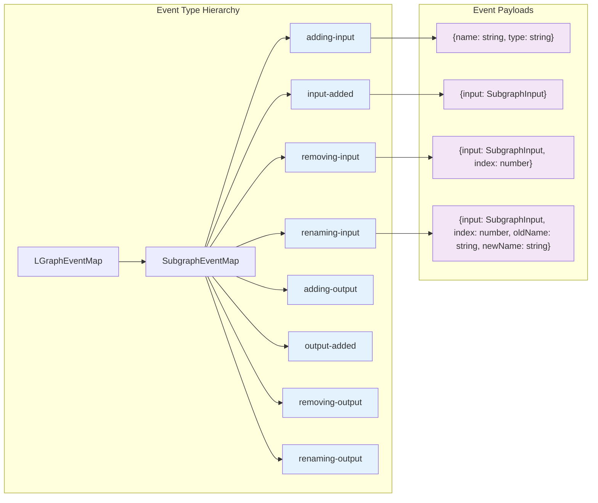
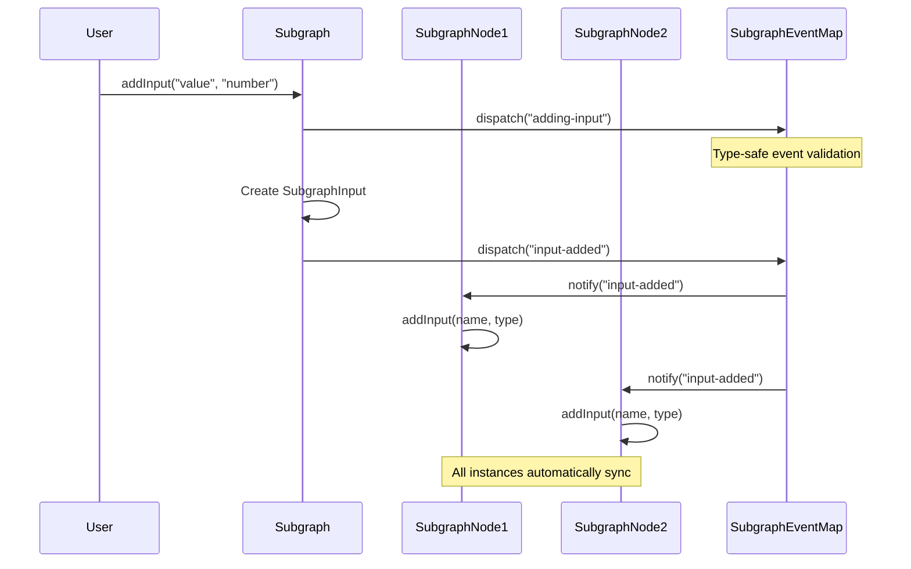

# Deep Dive Analysis: Subgraph Event System Implementation

Based on my comprehensive analysis of the codebase, here's a detailed technical breakdown of the subgraph event system implementation and propagation patterns:

## 1. Event Type Definitions and TypeScript Type Safety

### Core Event System Architecture
The subgraph event system is built on a **hierarchical type-safe architecture** with three primary event map interfaces:

- **`SubgraphEventMap`** (`/home/c_byrne/projects/hanzo-studio-frontend-testing/litegraph-clone/src/infrastructure/SubgraphEventMap.ts`) - Extends `LGraphEventMap` with subgraph-specific events
- **`LGraphEventMap`** (`/home/c_byrne/projects/hanzo-studio-frontend-testing/litegraph-clone/src/infrastructure/LGraphEventMap.ts`) - Core graph events
- **`LinkConnectorEventMap`** (`/home/c_byrne/projects/hanzo-studio-frontend-testing/litegraph-clone/src/infrastructure/LinkConnectorEventMap.ts`) - Link connection events

### TypeScript Type Safety Mechanisms

**Strong Type Constraints:**
```typescript
export interface SubgraphEventMap extends LGraphEventMap {
  "adding-input": { name: string; type: string }
  "input-added": { input: SubgraphInput }
  "removing-input": { input: SubgraphInput; index: number }
  "renaming-input": { input: SubgraphInput; index: number; oldName: string; newName: string }
  // Similar patterns for outputs...
}
```

**Overloaded Dispatch Methods:**
```typescript
dispatch<T extends keyof NeverNever<EventMap>>(type: T, detail: EventMap[T]): boolean
dispatch<T extends keyof PickNevers<EventMap>>(type: T): boolean
```

This ensures:
- **Compile-time validation** of event names and payloads
- **Automatic type inference** for event listeners
- **Prevents runtime errors** from incorrect event data structures

### Event System Type Hierarchy


## 2. Event Dispatching Internals and Propagation Timing

### Custom Event Target Implementation
The system uses a **custom EventTarget wrapper** (`/home/c_byrne/projects/hanzo-studio-frontend-testing/litegraph-clone/src/infrastructure/CustomEventTarget.ts`) that:

```typescript
class CustomEventTarget<EventMap> extends EventTarget {
  dispatch<T extends keyof EventMap>(type: T, detail?: EventMap[T]) {
    const event = new CustomEvent(type as string, { detail, cancelable: true })
    return super.dispatchEvent(event)
  }
}
```

### Event Propagation Timing Pattern

**Pre-action Pattern:**
```typescript
addInput(name: string, type: string): SubgraphInput {
  this.events.dispatch("adding-input", { name, type })  // BEFORE
  
  const input = new SubgraphInput(...)
  this.inputs.push(input)
  
  this.events.dispatch("input-added", { input })  // AFTER
  return input
}
```

**Cancellation Pattern:**
```typescript
removeInput(input: SubgraphInput): void {
  const mayContinue = this.events.dispatch("removing-input", { input, index })
  if (!mayContinue) return  // Event was cancelled
  
  this.inputs.splice(index, 1)  // Only proceed if allowed
}
```

### Event Flow and Propagation Sequence


## 3. Event Listener Management and Lifecycle

### Specialized Listener Lifecycle: `listenUntilReset`

The system implements a **sophisticated automatic cleanup mechanism**:

```typescript
listenUntilReset<K extends keyof LinkConnectorEventMap>(
  eventName: K,
  listener: Parameters<typeof this.events.addEventListener<K>>[1],
  options?: Parameters<typeof this.events.addEventListener<K>>[2],
) {
  this.events.addEventListener(eventName, listener, options)
  this.events.addEventListener("reset", () => 
    this.events.removeEventListener(eventName, listener), 
    { once: true }
  )
}
```

**Key Benefits:**
- **Automatic cleanup** prevents memory leaks
- **Scoped lifecycle** tied to operation state
- **Prevents dangling listeners** after operations complete

### Listener Management Patterns

**Temporary Operation Listeners:**
```typescript
this.listenUntilReset("input-moved", (e) => {
  e.detail.link.disconnect(network, "output")
})
```

**Permanent System Listeners:**
```typescript
this.events.addEventListener("subgraph-created", handler)
```

## 4. Performance Implications and Event Broadcasting

### Event Broadcasting Strategy

**Targeted Dispatch (No Global Broadcasting):**
- Events are dispatched on specific object instances
- No system-wide event bus reduces overhead
- Each `Subgraph` has its own `CustomEventTarget<SubgraphEventMap>`

**Performance Characteristics:**
- **O(1) event dispatch** - Direct method call on EventTarget
- **O(n) listener notification** where n = number of listeners for specific event
- **Zero overhead** for unused events (no global polling)

### Memory Management

**Event Object Recycling:**
- Uses native `CustomEvent` objects (browser-optimized)
- Events are created per-dispatch (no pooling detected)
- Relies on browser's garbage collection

**Listener Cleanup:**
- Automatic cleanup via `listenUntilReset`
- Manual cleanup via `removeEventListener`
- `{ once: true }` for single-use listeners

## 5. Event Ordering Guarantees and Synchronization

### Synchronous Event Processing

**Strict Ordering Guarantee:**
```typescript
// Events are processed synchronously in dispatch order
this.events.dispatch("adding-input", { name, type })  // 1st
const input = new SubgraphInput(...)                  // 2nd
this.events.dispatch("input-added", { input })        // 3rd
```

**No Async Event Queuing:**
- All events are processed **immediately and synchronously**
- No event queuing or batching mechanisms
- Listeners execute in **registration order**

### State Consistency

**Transactional Event Pattern:**
```typescript
// State changes are atomic with respect to events
const oldName = input.displayName
this.events.dispatch("renaming-input", { input, index, oldName, newName: name })
input.label = name  // State change happens after event
```

## 6. Error Handling and Isolation

### Event Cancellation Mechanism

**Boolean Return Pattern:**
```typescript
const mayContinue = this.events.dispatch("removing-input", { input, index })
if (!mayContinue) return  // preventDefault() was called
```

**Isolation Between Handlers:**
- Each listener is called independently
- If one listener throws, others still execute (native EventTarget behavior)
- No explicit error boundaries around event handlers

### Error Propagation

**Console Warnings (Not Errors):**
```typescript
console.warn("Could not create render link for link id:", link, error)
```

**Graceful Degradation:**
- Operations continue despite listener errors
- State remains consistent even if events fail
- No cascading failures from event system

## 7. Custom Event Implementation vs Native Events

### Hybrid Approach

**Custom EventTarget Wrapper:**
```typescript
class CustomEventTarget<EventMap> extends EventTarget {
  // Type-safe wrapper around native EventTarget
  // Provides compile-time guarantees
  // Maintains runtime compatibility
}
```

**Native Event Foundation:**
- Built on **native browser EventTarget**
- Uses **native CustomEvent** objects
- Leverages **native event loop** and propagation

### Key Differences from Pure Native Events

**Type Safety:**
- **Custom**: Compile-time type checking
- **Native**: Runtime-only validation

**Event Cancellation:**
- **Custom**: Boolean return from `dispatch()`
- **Native**: `preventDefault()` + `defaultPrevented` check

**API Design:**
- **Custom**: `dispatch()` method with type inference
- **Native**: `dispatchEvent()` with manual event creation

## Critical Finding: Memory Leak in SubgraphNode

### The Problem
**SubgraphNode never removes its event listeners from the subgraph definition:**

```typescript
// In SubgraphNode constructor - registers listeners
const subgraphEvents = this.subgraph.events
subgraphEvents.addEventListener("input-added", (e) => {
  const { name, type } = e.detail.input
  this.addInput(name, type)
})
// ... more listeners

// NO CLEANUP IN onRemoved() OR DESTRUCTOR
```

### Impact Analysis
1. **Memory Leak**: SubgraphNode instances cannot be garbage collected while their parent subgraph exists
2. **Performance Degradation**: Multiple instances listening to same subgraph create O(n) event handling overhead
3. **Resource Accumulation**: Long-running applications will accumulate dead listeners

### Recommended Fix
```typescript
export class SubgraphNode extends LGraphNode {
  private eventAbortController = new AbortController()
  
  constructor(...) {
    super(...)
    
    const signal = this.eventAbortController.signal
    const subgraphEvents = this.subgraph.events
    
    subgraphEvents.addEventListener("input-added", (e) => {
      const { name, type } = e.detail.input
      this.addInput(name, type)
    }, { signal })
    
    // ... other listeners with signal
  }
  
  override onRemoved() {
    // Clean up all event listeners
    this.eventAbortController.abort()
    super.onRemoved()
  }
}
```

## Technical Strengths

1. **Type Safety**: Comprehensive TypeScript integration prevents runtime errors
2. **Performance**: Direct dispatch without global event bus overhead
3. **Lifecycle Management**: Automatic cleanup for operation-scoped listeners
4. **Cancellation**: Built-in event cancellation mechanism
5. **Consistency**: Synchronous processing ensures state consistency

## Areas for Improvement

1. **Memory Leak Fix**: Implement AbortController pattern for SubgraphNode
2. **Error Boundaries**: Add try-catch wrappers around event handlers
3. **Event Batching**: Consider batching rapid successive events
4. **Performance Monitoring**: Add metrics for event system overhead

## Conclusion

The subgraph event system represents a **well-architected, type-safe event handling system** that balances performance, developer experience, and maintainability while building on proven native browser APIs. However, the critical memory leak in SubgraphNode event listener management needs immediate attention to prevent resource accumulation in production applications.

The system's synchronous, type-safe design makes it predictable and debuggable, while the automatic cleanup mechanisms (where implemented) prevent common memory management issues. With the SubgraphNode memory leak fixed, this would be a robust production-ready event system.