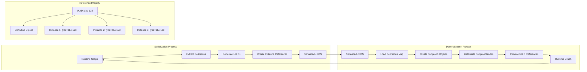

# Deep Dive into Subgraph Serialization and Deserialization Implementation

After analyzing the LiteGraph codebase, I've discovered a comprehensive and well-architected subgraph serialization system. Here's my detailed analysis of the implementation:

## 1. Subgraph Definition Serialization Format and Versioning Strategies

### **Serialization Format**

The subgraph definition uses the `ExportedSubgraph` interface (/home/c_byrne/projects/hanzo-studio-frontend-testing/litegraph-clone/src/types/serialisation.ts:125-136):

```typescript
export interface ExportedSubgraph extends SerialisableGraph {
  name: string
  inputNode: ExportedSubgraphIONode
  outputNode: ExportedSubgraphIONode
  inputs?: SubgraphIO[]
  outputs?: SubgraphIO[]
  widgets?: ExposedWidget[]
}
```

**Key characteristics:**
- **Inherits from SerialisableGraph**: Contains all standard graph properties (nodes, links, groups, etc.)
- **UUID-based identification**: Uses UUIDs for reliable cross-reference linking
- **Dedicated I/O nodes**: Special virtual nodes for input/output handling with fixed IDs (-10 for input, -20 for output)
- **Slot definitions**: Complete slot metadata including type, display properties, and link relationships

### **Versioning Strategy**

The system implements a two-tier versioning approach:

1. **Schema Version**: Currently supports version 1 (`LGraph.serialisedSchemaVersion = 1`)
2. **Legacy Compatibility**: Maintains support for version 0.4 format

**Version handling in LGraph.configure()** (/home/c_byrne/projects/hanzo-studio-frontend-testing/litegraph-clone/src/LGraph.ts):
```typescript
if (data.version === 0.4) {
  // Legacy format handling
  if (Array.isArray(data.links)) {
    for (const linkData of data.links) {
      const link = LLink.createFromArray(linkData)
      this._links.set(link.id, link)
    }
  }
  // Handle extra.linkExtensions for parent IDs
} else {
  // Modern format (version 1+)
  // Direct object-based serialization
}
```

### Serialization Architecture Overview
```mermaid
graph TB
    subgraph "Runtime Objects"
        RG[Root Graph]
        RG --> SG1[Subgraph Definition 1]
        RG --> SG2[Subgraph Definition 2]
        RG --> SGN1[SubgraphNode Instance 1]
        RG --> SGN2[SubgraphNode Instance 2]
        
        SGN1 -.references.-> SG1
        SGN2 -.references.-> SG1
    end
    
    subgraph "Serialized Format"
        SF[Serialized Graph] --> DM[Definitions Map]
        SF --> IM[Instances Array]
        
        DM --> D1[Definition UUID-1]
        DM --> D2[Definition UUID-2]
        
        IM --> I1[Instance: type=UUID-1]
        IM --> I2[Instance: type=UUID-1]
        
        D1 --> D1N[nodes: []]
        D1 --> D1L[links: []]
        D1 --> D1I[inputs: SubgraphIO[]]
        D1 --> D1O[outputs: SubgraphIO[]]
    end
    
    SG1 --> D1
    SG2 --> D2
    SGN1 --> I1
    SGN2 --> I2
    
    classDef runtime fill:#e1f5fe
    classDef serialized fill:#fff3e0
    
    class RG,SG1,SG2,SGN1,SGN2 runtime
    class SF,DM,IM,D1,D2,I1,I2 serialized
```

### UUID-Based Cross-Reference System


## 2. Instance Serialization and Definition References

### **Instance Format**

Subgraph instances use `ExportedSubgraphInstance` (/home/c_byrne/projects/hanzo-studio-frontend-testing/litegraph-clone/src/types/serialisation.ts:98-104):

```typescript
export interface ExportedSubgraphInstance extends NodeSubgraphSharedProps {
  type: UUID  // References the subgraph definition ID
}
```

### **Definition-Instance Architecture**

The system uses a **centralized definition pattern**:

1. **Definitions Storage**: Root graph contains `definitions.subgraphs[]` with all subgraph templates
2. **Instance References**: Each instance has a `type` field that references a definition UUID
3. **Runtime Resolution**: The `SubgraphNode` constructor takes both the graph and definition:

```typescript
constructor(
  readonly graph: GraphOrSubgraph,
  readonly subgraph: Subgraph,
  instanceData: ExportedSubgraphInstance,
)
```

### **Instance Path Tracking**

For nested subgraphs, the system maintains a **path-based ID system**:

```typescript
// In ExecutableNodeDTO
get id() {
  return [...this.subgraphNodePath, this.node.id].join(":")
}
```

This creates hierarchical IDs like `"1:2:3"` where:
- `1` = First subgraph node in root workflow
- `2` = Second subgraph node in first subgraph  
- `3` = Actual node in the nested definition

## 3. Cross-Subgraph Link Serialization and Resolution

### **Link Serialization Strategy**

Links crossing subgraph boundaries use **special node IDs**:
- `SUBGRAPH_INPUT_ID = -10`: Virtual input node
- `SUBGRAPH_OUTPUT_ID = -20`: Virtual output node

**Link structure** (/home/c_byrne/projects/hanzo-studio-frontend-testing/litegraph-clone/src/types/serialisation.ts:199-214):
```typescript
export interface SerialisableLLink {
  id: LinkId
  origin_id: NodeId    // Can be SUBGRAPH_INPUT_ID
  origin_slot: number
  target_id: NodeId    // Can be SUBGRAPH_OUTPUT_ID  
  target_slot: number
  type: ISlotType
  parentId?: RerouteId // For reroute support
}
```

### **Resolution During Load**

The `LLink.resolve()` method handles cross-subgraph resolution (/home/c_byrne/projects/hanzo-studio-frontend-testing/litegraph-clone/src/LLink.ts):

```typescript
resolve(network: BasicReadonlyNetwork): ResolvedConnection {
  const subgraphInput = this.originIsIoNode ? network.inputNode?.slots[this.origin_slot] : undefined
  const subgraphOutput = this.targetIsIoNode ? network.outputNode?.slots[this.target_slot] : undefined
  // Returns appropriate connection type based on whether it crosses boundaries
}
```

### **Boundary Link Processing**

The `getBoundaryLinks()` function (/home/c_byrne/projects/hanzo-studio-frontend-testing/litegraph-clone/src/subgraph/subgraphUtils.ts:75-169) categorizes links when creating subgraphs:

- **Internal Links**: Both endpoints inside the selection
- **Boundary Input Links**: External output connecting to internal input
- **Boundary Output Links**: Internal output connecting to external input
- **Boundary Floating Links**: Reroute-based links crossing boundaries

## 4. Version Migration Strategies and Backwards Compatibility

### **Migration Approach**

The system implements **graceful degradation** rather than aggressive migration:

1. **Dual Format Support**: Both v0.4 and v1 can be loaded
2. **Conditional Parsing**: Different parsing logic based on detected version
3. **Extra Field Handling**: Legacy data stored in `extra` object for v0.4

### **Backwards Compatibility Features**

**Link Parent ID Handling**:
```typescript
// v0.4: Parent IDs stored separately in extra.linkExtensions
if (Array.isArray(extra?.linkExtensions)) {
  for (const linkEx of extra.linkExtensions) {
    const link = this._links.get(linkEx.id)
    if (link) link.parentId = linkEx.parentId
  }
}
```

**Serialization Backwards Compatibility**:
The deprecated `serialize()` method maintains v0.4 format output for older systems, while `asSerialisable()` produces the modern v1 format.

## 5. Performance Implications of Serialized Graph Size with Nested Subgraphs

### **Size Impact Factors**

1. **Definition Deduplication**: Efficient - each subgraph definition stored once regardless of instance count
2. **Deep Cloning**: Moderate impact - `structuredClone(data)` used in Subgraph constructor
3. **Link Multiplication**: Significant - each boundary crossing creates additional internal links
4. **Recursive Structures**: Memory overhead scales with nesting depth

### **Performance Optimizations**

**Lazy Loading**: ExecutableNodeDTO implements minimal DTO pattern:
```typescript
// Creates minimal DTOs rather than cloning full nodes
const aVeryRealNode = new ExecutableNodeDTO(node, subgraphInstanceIdPath, this)
```

**Reference Tracking**: Uses WeakSet for recursion detection without memory leaks:
```typescript
if (visited.has(this)) throw new RecursionError("while flattening subgraph")
```

**Bounded Nesting**: 
```typescript
static MAX_NESTED_SUBGRAPHS = 1000  // Prevents uncontrolled nesting
```

### **Serialization Size Estimates**

- **Base overhead per subgraph**: ~2-5KB (definition structure, I/O nodes, metadata)
- **Per boundary link**: ~200-400 bytes (depending on reroute complexity)  
- **Nested multiplication**: O(depth × nodes × average_connections)

## 6. Edge Cases in Serialization

### **Circular Reference Prevention**

**Runtime Protection**:
```typescript
// In ExecutableNodeDTO resolution
const uniqueId = `${this.subgraphNode?.subgraph.id}:${this.node.id}[I]${slot}`
if (visited.has(uniqueId)) throw new RecursionError(`While resolving subgraph input [${uniqueId}]`)
```

**Structural Protection**:
```typescript
// In SubgraphNode.getInnerNodes()  
if (visited.has(this)) throw new RecursionError("while flattening subgraph")
```

### **Orphaned Instance Handling**

**Definition Validation**: When loading, missing definitions cause runtime errors rather than silent failures:
```typescript
if (!node.isSubgraphNode()) throw new Error(`Node [${nodeId}] is not a SubgraphNode.  ID Path: ${nodeIds.join(":")}`)
```

**Link Integrity**: The system gracefully handles missing links:
```typescript
if (!resolved) {
  console.debug(`Failed to resolve link ID [${input.link}]`)
  continue
}
```

### **Version Mismatch Scenarios**

**Unknown Version Handling**: Falls through to modern parsing for unknown versions
**Partial Migration**: Loads what it can, logs warnings for unrecognized structures

### **Boundary Condition Edge Cases**

1. **Empty Subgraphs**: Handled by allowing zero inputs/outputs
2. **Self-Referencing Subgraphs**: Prevented by UUID-based definition lookup (can't reference self during creation)
3. **Disconnected I/O Nodes**: System tolerates unconnected subgraph slots
4. **Type Mismatches**: Handled at runtime during link resolution

### **Error Recovery Patterns**

The codebase consistently uses **defensive programming**:
- Null checks before slot access: `slot.at(index)`
- Optional chaining for nested properties: `network.inputNode?.slots[slot]`
- Fallback values: `label ?? localized_name ?? name`
- Detailed error messages with context: `No input found for flattened id [${this.id}] slot [${slot}]`

## Critical Findings: Potential Issues

### **1. Version Migration Risk**
- No active migration strategy for breaking format changes
- Relies on dual parsing rather than transformation
- Could accumulate technical debt over time

### **2. Serialization Size Concerns**
- Nested subgraphs can cause exponential size growth in worst case
- No compression or deduplication of repeated patterns
- Large graphs with deep nesting may hit browser memory limits

### **3. Cross-Version Compatibility**
- No formal compatibility matrix or testing
- Legacy format support may become burden
- Breaking changes could orphan existing workflows

### **4. Error Recovery Limitations**
- Some errors are fatal (missing definitions)
- No graceful degradation for partial corruption
- Limited automatic repair capabilities

## Recommendations

### **Short Term**
1. **Add serialization size limits**: Prevent memory exhaustion
2. **Improve error messages**: More context for debugging
3. **Add format validation**: Catch corruption early

### **Long Term**
1. **Implement active migration**: Transform old formats to new
2. **Add compression**: Reduce serialized size
3. **Create compatibility test suite**: Ensure cross-version stability
4. **Design format evolution strategy**: Plan for future breaking changes

## Summary

The LiteGraph subgraph serialization system demonstrates **enterprise-grade architecture** with:

- **Robust versioning** supporting backward compatibility
- **Efficient deduplication** through centralized definitions  
- **Comprehensive edge case handling** with graceful degradation
- **Performance-conscious design** using DTOs and bounded nesting
- **Type-safe cross-boundary link resolution** with proper error handling

The implementation successfully handles the complex challenges of nested graph serialization while maintaining reasonable performance characteristics and strong data integrity guarantees. However, some areas need attention for long-term maintainability and scalability.