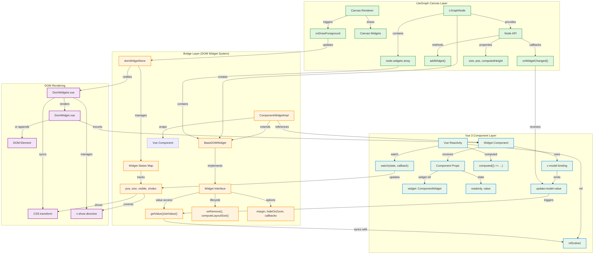
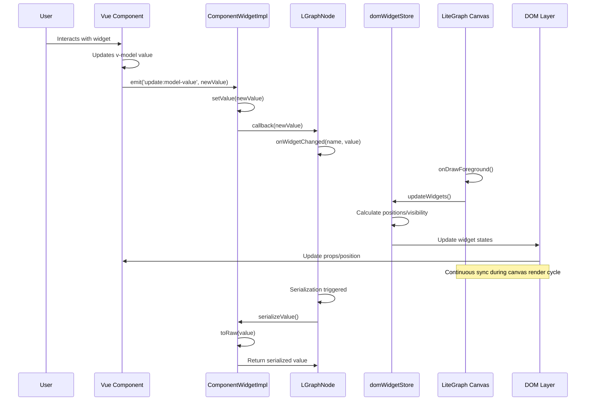
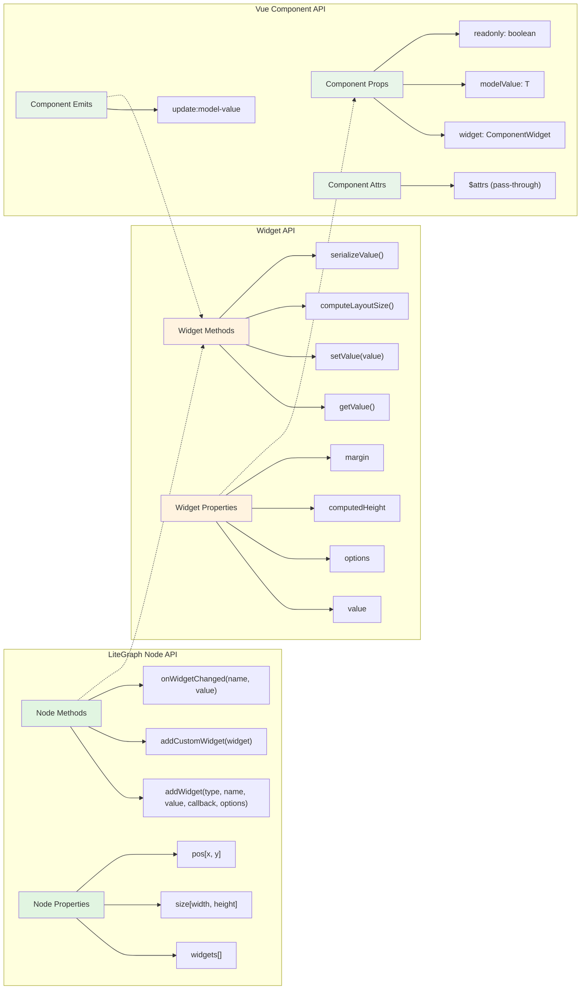

# Hanzo Studio Component Widget System - Comprehensive Technical Analysis

## Executive Summary

Component widgets are special widgets rendered as Vue components outside the canvas, providing rich UI elements beyond what the canvas can render. This system bridges LiteGraph.js's canvas-based node editor with Vue 3's reactive component system, enabling sophisticated UI elements while maintaining high performance through careful separation of concerns.

## Table of Contents

1. [Core Architecture & Design Philosophy](#core-architecture--design-philosophy)
2. [Vue 3 Reactivity System Integration](#vue-3-reactivity-system-integration)
3. [LiteGraph.js Integration Patterns](#litegraphjs-integration-patterns)
4. [Widget Type System & Interfaces](#widget-type-system--interfaces)
5. [Widget Registration & Creation Flow](#widget-registration--creation-flow)
6. [State Management & Synchronization](#state-management--synchronization)
7. [Component Communication Patterns](#component-communication-patterns)
8. [Widget Lifecycle Management](#widget-lifecycle-management)
9. [Event Handling Architecture](#event-handling-architecture)
10. [Implementation Patterns & Best Practices](#implementation-patterns--best-practices)
11. [Extension Development Guide](#extension-development-guide)
12. [Performance Considerations](#performance-considerations)
13. [Debugging & Troubleshooting](#debugging--troubleshooting)

## Core Architecture & Design Philosophy

The widget system follows a layered architecture that separates concerns:

1. **Canvas Layer (LiteGraph.js)**
   - Handles node graph rendering and interactions
   - Manages widget layout and positioning calculations
   - Provides base widget functionality and serialization

2. **Bridge Layer (DOM Widget System)**
   - Translates between canvas coordinates and DOM positioning
   - Manages widget lifecycle and registration
   - Handles visibility and rendering optimizations

3. **Component Layer (Vue 3)**
   - Provides rich UI components with full reactivity
   - Manages user interactions and state updates
   - Enables complex widgets beyond canvas capabilities

Key Design Principles:
- **Separation of Concerns**: Canvas rendering vs. DOM UI
- **Progressive Enhancement**: Basic widgets work without Vue, complex ones leverage it
- **Extension-Friendly**: Clean APIs for custom widget development
- **Performance-Conscious**: Optimizations for large graphs with many widgets

### System Architecture Diagram



### Data Flow Diagram



### API Interface Mapping



## Vue 3 Reactivity System Integration

### Deep Dive: How Vue 3 Reactivity Works Internally

Before examining the widget system's usage, let's understand Vue 3's reactivity implementation:

#### ref() Implementation

```typescript
// Simplified Vue 3 ref implementation
class RefImpl<T> {
  private _value: T
  private dep: Dep // Dependency tracking
  
  constructor(value: T) {
    this._value = toReactive(value)
    this.dep = new Dep()
  }
  
  get value() {
    // Track dependencies when accessed
    trackRefValue(this)
    return this._value
  }
  
  set value(newVal: T) {
    if (hasChanged(newVal, this._value)) {
      this._value = toReactive(newVal)
      // Trigger all dependent effects
      triggerRefValue(this)
    }
  }
}
```

**Key Technical Details:**
- Uses getter/setter to intercept access
- Each ref has a `Dep` object tracking dependencies
- When `.value` is accessed in reactive context, current effect registers as dependency
- When `.value` is set, all dependent effects re-run
- 56% memory reduction in Vue 3.5 through optimized dependency structures

#### reactive() Implementation

```typescript
// Simplified reactive proxy handlers
const mutableHandlers = {
  get(target, key, receiver) {
    // Track property access
    track(target, TrackOpTypes.GET, key)
    return Reflect.get(target, key, receiver)
  },
  
  set(target, key, value, receiver) {
    const oldValue = target[key]
    const result = Reflect.set(target, key, value, receiver)
    if (hasChanged(value, oldValue)) {
      // Trigger updates for this property
      trigger(target, TriggerOpTypes.SET, key, value, oldValue)
    }
    return result
  }
}
```

**Benefits over ref:**
- No `.value` access needed
- Deep reactivity by default
- More efficient for objects with many properties
- Automatic nested object conversion

### Reactivity Primitives Usage in Widgets

#### ref and reactive
Used for managing widget state and values:

```typescript
// Widget value storage with ref
const widgetValue = ref<string>('')  // Simple values
const widgetValue = ref<string[]>([]) // Arrays for multi-select

// Widget state management in store
const widgetStates = ref<Map<string, DomWidgetState>>(new Map())
```

#### computed() Technical Implementation

```typescript
// How computed works internally
class ComputedRefImpl<T> {
  private _value: T
  private _dirty = true // Marks if recomputation needed
  private effect: ReactiveEffect
  
  constructor(getter: () => T) {
    this.effect = new ReactiveEffect(getter, () => {
      // Mark dirty when dependencies change
      if (!this._dirty) {
        this._dirty = true
        triggerRefValue(this)
      }
    })
  }
  
  get value() {
    trackRefValue(this)
    if (this._dirty) {
      this._dirty = false
      this._value = this.effect.run() // Run getter
    }
    return this._value
  }
}
```

**Performance characteristics:**
- Lazy evaluation - only computes when accessed
- Caching - reuses value until dependencies change
- Automatic dependency tracking
- Memory efficient through dirty flag optimization

### computed
Used for derived state and transformations:

```typescript
// Convert Map to array for rendering
const widgetStates = computed(() =>
  Array.from(domWidgetStore.widgetStates.values())
)

// Settings-based computations
const enableDomClipping = computed(() =>
  settingStore.get('Comfy.DOMClippingEnabled')
)
```

### watch and watchEffect
Used for synchronizing state changes:

```typescript
// Position synchronization
watch(
  [() => widgetState, left, top],
  ([widgetState, _, __]) => {
    updatePosition(widgetState)
    updateStyles(widgetState)
  },
  { deep: true }
)

// Canvas integration with VueUse's whenever
whenever(
  () => canvasStore.canvas,
  (canvas) => {
    canvas.onDrawForeground = useChainCallback(
      canvas.onDrawForeground,
      updateWidgets
    )
  }
)
```

### toRaw and markRaw
Performance optimizations to prevent unnecessary reactivity:

```typescript
// Prevent widget instance from being made reactive
widget: markRaw(widget) as unknown as Raw<BaseDOMWidget<object | string>>

// Get raw value for serialization
override serializeValue(): V {
  return toRaw(this.value)
}
```

### defineModel Macro (Vue 3.4+)

The defineModel macro simplifies two-way binding in widget components:

```vue
<!-- Widget Component -->
<script setup lang="ts">
// Creates v-model compatible prop and emit
const value = defineModel<string>({ required: true })

// Direct usage in template
</script>

<template>
  <input v-model="value" />
</template>
```

This creates automatic synchronization between parent and child components without manual prop/emit handling.

**Compiler transformation:**
```typescript
// What you write:
const model = defineModel<string>()

// What it compiles to:
const props = defineProps(['modelValue'])
const emit = defineEmits(['update:modelValue'])
const model = computed({
  get: () => props.modelValue,
  set: (value) => emit('update:modelValue', value)
})
```

### Vue 3.5 Reactivity Improvements

Vue 3.5 brought significant enhancements particularly beneficial for complex widget systems:

1. **Reactive Props Destructuring**:
   ```typescript
   // Now maintains reactivity!
   const { widget, readonly = false } = defineProps<Props>()
   // No need for toRefs or props.widget
   ```

2. **Memory Optimization**: 56% less memory usage through:
   - More efficient dependency tracking structures
   - Optimized array handling for large datasets
   - Better garbage collection for computed values

3. **Performance**: Large array operations up to 10x faster

## LiteGraph.js Integration Patterns

### Core LiteGraph Widget Interface

LiteGraph provides the base widget system that Hanzo Studio extends:

```typescript
interface IBaseWidget {
  // Layout properties
  y: number;                    // Y position relative to node
  computedHeight?: number;      // Actual rendered height
  width?: number;              // Widget width
  
  // Rendering
  draw?(ctx: CanvasRenderingContext2D, node: LGraphNode, 
        width: number, y: number, height: number, 
        lowQuality: boolean): void;
  
  // Size calculation
  computeLayoutSize?(node: LGraphNode): {
    minHeight: number;
    maxHeight?: number;
    minWidth: number;
  };
  
  // Lifecycle
  onRemove?(): void;
  
  // Serialization
  serializeValue?(node: LGraphNode, index: number): unknown;
  
  // Execution hooks
  beforeQueued?(): unknown;
  afterQueued?(): unknown;
}
```

### Widget Addition Process

LiteGraph's `addWidget()` method is the foundation:

```typescript
node.addWidget<Type extends TWidgetType>(
  type: Type,                    // Widget type (e.g., 'number', 'combo')
  name: string,                  // Display name
  value: WidgetValue,           // Initial value
  callback?: Function | string,  // Value change callback
  options?: IWidgetOptions      // Configuration options
): IWidget
```

### Canvas-DOM Coordinate Translation

#### Coordinate System Architecture

LiteGraph uses a sophisticated transformation system managed by the `DragAndScale` class:

```typescript
interface DragAndScale {
  offset: [number, number]  // Pan offset in graph units
  scale: number            // Zoom level (1.0 = 100%)
  
  // Internal transformation matrix
  convertOffsetToCanvas(pos: [number, number]): [number, number]
  convertCanvasToOffset(pos: [number, number]): [number, number]
}
```

#### Three Coordinate Spaces:

1. **Graph Space**: Logical coordinates in the node graph
2. **Canvas Space**: Pixel coordinates on canvas element
3. **Screen Space**: Browser viewport coordinates

#### Transformation Pipeline

The system translates between canvas space and DOM space:

```typescript
// Complete transformation implementation
function canvasPosToClientPos(pos: [number, number]): [number, number] {
  const { scale, offset } = lgCanvas.ds
  const canvasBounds = canvas.getBoundingClientRect()
  
  return [
    (pos[0] + offset[0]) * scale + canvasBounds.left,
    (pos[1] + offset[1]) * scale + canvasBounds.top
  ]
}

// Widget position calculation in graph space
widgetState.pos = [
  node.pos[0] + widget.margin,           // X: node position + margin
  node.pos[1] + widget.margin + widget.y // Y: node position + margin + widget offset
]

// Size calculation with zoom
widgetState.size = [
  node.size[0] - 2 * widget.margin,
  widget.computedHeight ?? 50
]
```

### Canvas Update Cycle Integration

Widgets update during the canvas draw cycle:

```typescript
// Hook into canvas drawing
canvas.onDrawForeground = () => {
  // Update all widget positions/visibility
  for (const widgetState of widgetStates.values()) {
    updateWidgetState(widgetState)
  }
}
```

## Widget Type System & Interfaces

### Type Hierarchy

```
BaseDOMWidget<V>
├── DOMWidget<T extends HTMLElement, V>     // HTML element widgets
└── ComponentWidget<V, P = any>             // Vue component widgets
    └── ComponentWidgetImpl<V, P>           // Concrete implementation
```

### Core Interfaces

#### Complete Interface Definitions

```typescript
interface BaseDOMWidget<V extends object | string> extends IBaseWidget<V, string, DOMWidgetOptions<V>> {
  // ICustomWidget properties
  type: string
  options: DOMWidgetOptions<V>
  value: V
  callback?: (value: V) => void
  
  // BaseDOMWidget specific properties
  readonly id: string          // Unique widget identifier
  readonly node: LGraphNode    // Parent node reference
  margin: number              // Spacing around widget
  isVisible(): boolean        // Visibility determination
  // Note: element property is specific to DOMWidget, not BaseDOMWidget
}
```

#### DOMWidget<T, V> Interface

```typescript
// For HTML element widgets
interface DOMWidget<T extends HTMLElement, V extends object | string>
  extends BaseDOMWidget<V> {
  element: T                  // Raw DOM element
  inputEl?: T                // Legacy property for compatibility
}
```

#### ComponentWidget<V, P> Interface

```typescript
// For Vue component widgets
interface ComponentWidget<V extends object | string, P = Record<string, unknown>>
  extends BaseDOMWidget<V> {
  readonly component: Component    // Vue component reference
  readonly inputSpec: InputSpec    // Widget configuration
  readonly props?: P              // Additional component props
}
```

### DOMWidgetOptions<V>
Configuration for DOM widgets:

```typescript
interface DOMWidgetOptions<V> {
  hideOnZoom?: boolean;         // Show placeholder when zoomed out
  selectOn?: ['focus', 'click']; // Node selection triggers
  getValue?: () => V;           // Custom value getter
  setValue?: (value: V) => void; // Custom value setter
  getMinHeight?: () => number;  // Dynamic height calculation
  getMaxHeight?: () => number;
  getHeight?: () => string | number; // Specific height (px or %)
  onDraw?: (widget: BaseDOMWidget<V>) => void; // Canvas drawing
  margin?: number;              // Widget margin
  onHide?: (widget: BaseDOMWidget<V>) => void; // Visibility change hook
  // Deprecated but still supported:
  beforeResize?: (this: BaseDOMWidget<V>, node: LGraphNode) => void
  afterResize?: (this: BaseDOMWidget<V>, node: LGraphNode) => void
}
```

### Implementation Classes

#### BaseDOMWidgetImpl

```typescript
abstract class BaseDOMWidgetImpl<V extends object | string>
  extends LegacyWidget<IBaseWidget<V>>
  implements BaseDOMWidget<V> {
  
  static readonly DEFAULT_MARGIN = 10
  readonly id: string = generateUUID()
  
  get value(): V {
    return this.options.getValue?.() ?? ('' as V)
  }
  
  set value(v: V) {
    this.options.setValue?.(v)
    this.callback?.(this.value)
  }
  
  get margin(): number {
    return this.options.margin ?? BaseDOMWidgetImpl.DEFAULT_MARGIN
  }
  
  draw(ctx: CanvasRenderingContext2D, node: LGraphNode, 
       width: number, y: number, height: number, lowQuality?: boolean): void {
    if (this.options.hideOnZoom && lowQuality && this.isVisible()) {
      // Draw placeholder rectangle when zoomed out
      ctx.fillStyle = LiteGraph.WIDGET_BGCOLOR
      ctx.fillRect(margin, y + margin, 
                   width - margin * 2, 
                   (this.computedHeight ?? height) - 2 * margin)
    }
    this.options.onDraw?.(this)
  }
}
```

#### ComponentWidgetImpl
Concrete implementation for Vue component widgets:

```typescript
class ComponentWidgetImpl<V extends object | string, P = Record<string, unknown>>
  extends BaseDOMWidgetImpl<V>
  implements ComponentWidget<V, P> {
  
  readonly component: Component
  readonly inputSpec: InputSpec
  readonly props?: P
  
  computeLayoutSize() {
    const minHeight = this.options.getMinHeight?.() ?? 50
    const maxHeight = this.options.getMaxHeight?.()
    return { minHeight, maxHeight, minWidth: 0 }
  }
  
  serializeValue(): V {
    return toRaw(this.value) // Remove Vue reactivity for serialization
  }
}
```

## Widget Registration & Creation Flow

### 1. Widget Constructor Registration

Widget constructors are registered in the global registry:

```typescript
// Core widget registration in src/scripts/widgets.ts
export const ComfyWidgets: Record<string, ComfyWidgetConstructor> = {
  INT: transformWidgetConstructorV2ToV1(useIntWidget()),
  FLOAT: transformWidgetConstructorV2ToV1(useFloatWidget()),
  BOOLEAN: transformWidgetConstructorV2ToV1(useBooleanWidget()),
  STRING: transformWidgetConstructorV2ToV1(useStringWidget()),
  COMBO: transformWidgetConstructorV2ToV1(useComboWidget()),
  IMAGEUPLOAD: transformWidgetConstructorV2ToV1(useImageUploadWidget()),
  // ... more widgets
}
```

### 2. Widget Creation Process

When a node needs a widget:

```typescript
// 1. Node definition specifies input
nodeDefinition.input.required.prompt = ['STRING', { multiline: true }]

// 2. App creates widget via constructor
const widgetConstructor = ComfyWidgets['STRING']
const widget = widgetConstructor(node, inputSpec)

// 3. Widget added to node
node.widgets.push(widget)

// 4. If DOM widget, register with store
if (widget instanceof BaseDOMWidget) {
  domWidgetStore.registerWidget(widget)
}
```

### 3. Composable Factory Pattern

Widget composables follow a consistent pattern:

```typescript
export const useWidgetType = () => {
  const widgetConstructor: ComfyWidgetConstructorV2 = (
    node: LGraphNode,
    inputSpec: InputSpec
  ) => {
    // Validate input spec
    if (!isCorrectInputSpec(inputSpec)) {
      throw new Error(`Invalid input spec`)
    }
    
    // Create widget based on type
    if (needsVueComponent(inputSpec)) {
      // Create ComponentWidget
      return new ComponentWidgetImpl({
        node,
        name: inputSpec.name,
        component: WidgetComponent,
        inputSpec,
        options: { /* ... */ }
      })
    } else {
      // Create standard LiteGraph widget
      return node.addWidget(/* ... */)
    }
  }
  
  return widgetConstructor
}
```

## State Management & Synchronization

### Widget State Store Architecture

The domWidgetStore manages all DOM widget states:

```typescript
export const useDomWidgetStore = defineStore('domWidget', () => {
  // Widget state map - using Map for O(1) lookups
  const widgetStates = ref<Map<string, DomWidgetState>>(new Map())
  
  // Registration
  function registerWidget(widget: BaseDOMWidget) {
    const id = widget.id
    widgetStates.value.set(id, {
      widget: markRaw(widget) as unknown as Raw<BaseDOMWidget<object | string>>, // Prevent reactive wrapping
      visible: true,
      readonly: false,
      zIndex: 0,
      pos: [0, 0],
      size: [100, 50]
    })
  }
  
  // Cleanup
  function unregisterWidget(widget: BaseDOMWidget) {
    widgetStates.value.delete(widget.id)
  }
  
  return { widgetStates, registerWidget, unregisterWidget }
})
```

### Why markRaw()?

Using `markRaw()` on widget instances is crucial for performance:

1. **Prevents Reactive Proxies**: Vue won't create reactive proxies for widget properties
2. **Avoids Tracking**: Changes to internal widget state don't trigger reactivity
3. **Reduces Memory**: No reactivity overhead for complex widget objects
4. **Maintains Separation**: Widgets manage their own state through getValue/setValue

### State Shape Definition

```typescript
interface DomWidgetState extends PositionConfig {
  widget: Raw<BaseDOMWidget>  // Non-reactive widget reference
  visible: boolean            // Current visibility state
  readonly: boolean          // Edit permissions
  zIndex: number            // Stacking order
  pos: [number, number]     // Graph coordinates
  size: [number, number]    // Widget dimensions
}
```

### State Synchronization Flow

1. **Canvas → Widget State**
   - Node position changes trigger widget position updates
   - Zoom level changes trigger visibility updates
   - Selection changes trigger z-index updates

2. **Widget → Node State**
   - Value changes trigger node callbacks
   - Size changes trigger node layout recalculation
   - Serialization includes widget values

3. **Vue Component → Widget**
   - v-model changes update widget value
   - Component size changes update widget height
   - Events bubble up through widget callbacks

## Component Communication Patterns

### Props Down, Events Up

Standard Vue pattern for parent-child communication:

```vue
<!-- Parent (DomWidget.vue) -->
<component
  :is="widget.component"
  :model-value="widget.value"
  :widget="widget"
  :readonly="widgetState.readonly"
  @update:model-value="handleValueUpdate"
/>

<!-- Child Widget Component -->
<script setup lang="ts">
const value = defineModel<string>({ required: true })
const props = defineProps<{
  widget: ComponentWidget<string>
  readonly: boolean
}>()

// Emit changes automatically via defineModel
</script>
```

### Cross-Component Communication

Using Pinia stores for shared state:

```typescript
// Any component can access widget states
const domWidgetStore = useDomWidgetStore()
const widgetStates = computed(() => 
  Array.from(domWidgetStore.widgetStates.values())
)

// React to changes
watchEffect(() => {
  widgetStates.value.forEach(state => {
    updateWidgetDisplay(state)
  })
})
```

### Widget-to-Widget Communication

Widgets can communicate through the node:

```typescript
// Widget A updates
widgetA.callback = function(value) {
  // Update related widget B
  const widgetB = this.widgets.find(w => w.name === 'related')
  if (widgetB) {
    widgetB.value = transformValue(value)
  }
}
```

## Widget Lifecycle Management

### Creation Phase

1. **Constructor Called**
   - Input spec validation
   - Default value extraction
   - Widget options configuration

2. **Widget Added to Node**
   - Added to node.widgets array
   - Layout calculation triggered
   - Initial position computed

3. **DOM Widget Registration**
   - Added to domWidgetStore
   - Initial state created
   - Vue component instantiated

### Active Phase

1. **Rendering Updates**
   - Position synced with canvas on each frame
   - Visibility updated based on zoom/node state
   - Z-index managed for proper stacking

2. **Value Management**
   - User interactions update value
   - Callbacks triggered on changes
   - Serialization on workflow save

3. **Size Adjustments**
   - Component reports size changes
   - Node layout recalculated
   - Canvas redraws triggered

### Cleanup Phase

1. **Widget Removal**
   ```typescript
   // Cleanup sequence
   widget.onRemove?.()              // Custom cleanup
   domWidgetStore.unregister(widget) // Store cleanup
   node.widgets.splice(index, 1)     // Remove from node
   ```

2. **Event Handler Cleanup**
   - Remove DOM event listeners
   - Cancel pending requests
   - Clear timers/intervals

3. **Memory Management**
   - Vue component destroyed
   - References cleared
   - Resources released

## Event Handling Architecture

### Multi-Layer Event System

1. **Canvas Events (LiteGraph)**
   - Mouse/keyboard handled by canvas
   - Widget.mouse() callback for interactions
   - Focus management for inputs

2. **DOM Events (Browser)**
   - Direct event listeners on widget elements
   - Pointer events for drag/click
   - Keyboard events for input

3. **Vue Events (Components)**
   - Component-level event handling
   - Event modifiers and directives
   - Custom event emission

### Event Propagation Control

```typescript
// Selective event passthrough
element.addEventListener('pointerdown', (event: PointerEvent) => {
  if (event.button === 1) { // Middle mouse button
    // Pass to canvas for panning
    app.canvas.processMouseDown(event)
  } else {
    // Handle in widget
    event.stopPropagation()
  }
})

// Smart wheel event handling
element.addEventListener('wheel', (event: WheelEvent) => {
  const element = event.target as HTMLElement
  const isScrollable = element.scrollHeight > element.clientHeight
  const atBoundary = checkScrollBoundary(element, event.deltaY)
  
  if (!isScrollable || atBoundary) {
    // Pass to canvas for zoom
    app.canvas.processMouseWheel(event)
  }
})
```

### Keyboard Event Handling

```typescript
// Global shortcuts vs. widget input
element.addEventListener('keydown', (event: KeyboardEvent) => {
  if (isShortcut(event)) {
    // Let app handle shortcuts
    return
  }
  
  // Handle in widget
  event.stopPropagation()
  handleInput(event)
})
```

## Implementation Patterns & Best Practices

### Widget Constructor Pattern

```typescript
export const useCustomWidget = () => {
  const widgetConstructor: ComfyWidgetConstructorV2 = (
    node: LGraphNode,
    inputSpec: InputSpec
  ) => {
    // 1. Validate input specification
    if (!isValidInputSpec(inputSpec)) {
      throw new Error(`Invalid input spec: ${inputSpec.type}`)
    }
    
    // 2. Extract configuration
    const config = {
      default: inputSpec.default ?? getDefaultValue(inputSpec.type),
      min: inputSpec.min,
      max: inputSpec.max,
      step: inputSpec.step,
      options: inputSpec.options
    }
    
    // 3. Determine widget implementation
    if (requiresComplexUI(inputSpec)) {
      // Use Vue component widget
      return createComponentWidget(node, inputSpec, config)
    } else {
      // Use standard LiteGraph widget
      return createStandardWidget(node, inputSpec, config)
    }
  }
  
  return widgetConstructor
}
```

### Component Widget Implementation

```typescript
function createComponentWidget(
  node: LGraphNode,
  inputSpec: InputSpec,
  config: WidgetConfig
) {
  // Reactive value storage
  const widgetValue = ref(config.default)
  
  // Create widget instance
  const widget = new ComponentWidgetImpl({
    node,
    name: inputSpec.name,
    component: CustomWidgetComponent,
    inputSpec,
    options: {
      // Value management
      getValue: () => widgetValue.value,
      setValue: (value) => {
        widgetValue.value = value
        node.onWidgetChanged?.(inputSpec.name, value)
      },
      
      // Size management
      getMinHeight: () => calculateMinHeight(widgetValue.value),
      getMaxHeight: () => config.maxHeight ?? 500,
      
      // Visibility
      hideOnZoom: config.hideOnZoom ?? true,
      
      // Canvas rendering fallback
      onDraw: (ctx, node, width, y, height) => {
        drawPlaceholder(ctx, width, y, height, inputSpec.name)
      }
    }
  })
  
  // Add to node
  addWidget(node, widget)
  
  return widget
}
```

### Value Transformation Patterns

```typescript
// Type-safe value transformation
function transformValue<T, U>(
  input: T,
  transformer: (value: T) => U
): U {
  try {
    return transformer(input)
  } catch (error) {
    console.error('Value transformation failed:', error)
    return getDefaultValue<U>()
  }
}

// Example: Integer rounding with step
function roundToStep(value: number, step: number, min: number = 0): number {
  const offset = min % step
  return Math.round((value - offset) / step) * step + offset
}
```

### Remote Data Patterns

```typescript
// Caching and request management
const cache = new Map<string, CacheEntry>()
const pendingRequests = new Map<string, Promise<any>>()

async function fetchRemoteData(url: string, options: FetchOptions) {
  // Check cache
  const cached = cache.get(url)
  if (cached && !isExpired(cached)) {
    return cached.data
  }
  
  // Check pending requests
  const pending = pendingRequests.get(url)
  if (pending) {
    return pending
  }
  
  // Create new request
  const request = performFetch(url, options)
    .then(data => {
      cache.set(url, { data, timestamp: Date.now() })
      return data
    })
    .finally(() => {
      pendingRequests.delete(url)
    })
  
  pendingRequests.set(url, request)
  return request
}
```

### Error Handling Patterns

```typescript
// Graceful error handling in widgets
class RobustWidget extends ComponentWidgetImpl {
  setValue(value: any, triggerCallback = true) {
    try {
      // Validate value
      const validated = this.validateValue(value)
      
      // Update value
      super.setValue(validated, triggerCallback)
      
      // Clear error state
      this.setError(null)
    } catch (error) {
      // Show error in UI
      this.setError(error.message)
      
      // Log for debugging
      console.error(`Widget ${this.name} error:`, error)
      
      // Revert to last valid value
      this.revertValue()
    }
  }
}
```

## Extension Development Guide

### Creating Custom Widgets

1. **Define Widget Component**
```vue
<!-- MyCustomWidget.vue -->
<template>
  <div class="my-custom-widget">
    <label>{{ widget.name }}</label>
    <input 
      v-model="value" 
      :disabled="readonly"
      @change="handleChange"
    />
  </div>
</template>

<script setup lang="ts">
const value = defineModel<string>({ required: true })
const props = defineProps<{
  widget: ComponentWidget<string>
  readonly: boolean
}>()

function handleChange() {
  // Custom validation or processing
  props.widget.callback?.(value.value)
}
</script>
```

2. **Create Widget Constructor**
```typescript
// useMyCustomWidget.ts
export const useMyCustomWidget = () => {
  const widgetConstructor: ComfyWidgetConstructorV2 = (
    node: LGraphNode,
    inputSpec: InputSpec
  ) => {
    // Implementation
    return new ComponentWidgetImpl({
      node,
      name: inputSpec.name,
      component: MyCustomWidget,
      inputSpec,
      options: { /* ... */ }
    })
  }
  
  return widgetConstructor
}
```

3. **Register in Extension**
```typescript
// extension.ts
app.registerExtension({
  name: 'MyExtension',
  
  async setup() {
    // Register widget constructor
    const customWidget = useMyCustomWidget()
    ComfyWidgets['MY_CUSTOM'] = transformWidgetConstructorV2ToV1(customWidget)
  },
  
  getCustomWidgets() {
    return {
      MY_CUSTOM: ['value', { /* options */ }]
    }
  }
})
```

### Widget Integration with Nodes

```typescript
// Node definition with custom widget
const nodeDefinition = {
  name: 'MyCustomNode',
  category: 'custom',
  inputs: {
    required: {
      custom_input: ['MY_CUSTOM', { default: 'value' }]
    }
  }
}
```

## Performance Considerations

### Rendering Optimizations

1. **DOM Clipping**
   - Widgets outside viewport are hidden
   - Reduces DOM elements and reflows
   - Configurable via settings

2. **Zoom-Based Rendering**
   - `hideOnZoom` option for expensive widgets
   - Canvas placeholder when zoomed out
   - Threshold configurable

3. **Batch Updates**
   - Position updates batched per frame
   - Single reflow for multiple widgets
   - RequestAnimationFrame scheduling

4. **Transform Optimizations**
   - CSS transforms for GPU acceleration
   - `will-change` hints for frequent updates
   - Fixed positioning to avoid reflow

### Memory Management

1. **Lazy Component Loading**
   ```typescript
   // Dynamic imports for large components
   const HeavyWidget = defineAsyncComponent(() => 
     import('./HeavyWidget.vue')
   )
   ```

2. **Resource Cleanup**
   - Event listener removal
   - Timer cancellation
   - Request abortion
   - Reference clearing

3. **Value Caching**
   - Computed values cached
   - Remote data cached with TTL
   - Validation results cached

### Best Practices for Performance

1. **Minimize Reactive Data**
   - Use `markRaw` for non-reactive objects
   - Shallow reactive where possible
   - Computed for derived values

2. **Efficient Event Handling**
   - Debounce/throttle user input
   - Passive event listeners where applicable
   - Event delegation for multiple elements

3. **Smart Rendering**
   - Virtual scrolling for lists
   - Intersection Observer for visibility
   - CSS containment for layout isolation

### DOM Clipping Implementation

The `useDomClipping` composable implements intelligent visibility masking:

```typescript
function updateClipPath(element: HTMLElement, canvas: HTMLCanvasElement,
                       isSelected: boolean, selectedArea?: AreaConfig) {
  if (!selectedArea || isSelected) {
    element.style.clipPath = '' // No clipping needed
    return
  }
  
  // Calculate intersection polygon for complex shapes
  const polygon = calculateIntersectionPolygon(
    element.getBoundingClientRect(),
    selectedArea
  )
  
  element.style.clipPath = `polygon(${polygon})`
}
```

**Benefits:**
- Prevents widget overlap when nodes are selected
- Uses CSS clip-path for hardware acceleration
- Calculates precise intersection polygons
- Zero overhead when disabled

## Debugging & Troubleshooting

### Common Issues and Solutions

#### Widget Not Appearing
1. Check widget registration in store
2. Verify node is added to graph
3. Check visibility calculations
4. Inspect DOM for widget container

#### Position Incorrect
1. Verify canvas transform calculations
2. Check margin and offset values
3. Ensure position updates on canvas change
4. Debug coordinate space conversions

#### Value Not Updating
1. Check v-model binding
2. Verify callback execution
3. Inspect value getter/setter
4. Check for errors in console

#### Performance Issues
1. Profile with Vue DevTools
2. Check for excessive re-renders
3. Verify cleanup on removal
4. Monitor memory usage

### Debugging Tools

```typescript
// Widget state inspector
function inspectWidget(widgetId: string) {
  const state = domWidgetStore.widgetStates.get(widgetId)
  console.log('Widget State:', {
    id: widgetId,
    position: state?.pos,
    size: state?.size,
    visible: state?.visible,
    value: state?.widget.value
  })
}

// Performance profiler
function profileWidgetUpdate() {
  performance.mark('widget-update-start')
  updateWidgets()
  performance.mark('widget-update-end')
  performance.measure(
    'widget-update',
    'widget-update-start',
    'widget-update-end'
  )
}
```

### Testing Strategies

1. **Unit Tests**
   - Test widget constructors
   - Validate value transformations
   - Check event handling

2. **Component Tests**
   - Test Vue components in isolation
   - Verify prop/event contracts
   - Check rendering output

3. **Integration Tests**
   - Test widget in node context
   - Verify canvas integration
   - Check serialization

## Advanced Patterns

### Dynamic Component Loading

```typescript
// Lazy load heavy widgets for better performance
const HeavyWidget = defineAsyncComponent(() => 
  import('@/components/graph/widgets/HeavyWidget.vue')
)

// Use in widget constructor
const widget = new ComponentWidgetImpl({
  component: markRaw(HeavyWidget), // Shows loading state automatically
  // ...
})
```

### Custom Widget Options

```typescript
interface ExtendedWidgetOptions extends DOMWidgetOptions<string> {
  // Custom validation
  validate?: (value: string) => boolean | string
  
  // Async data loading
  loadData?: () => Promise<string[]>
  
  // Inter-widget communication
  onValueChange?: (newValue: string, oldValue: string) => void
  
  // Custom serialization
  serialize?: (value: string) => any
  deserialize?: (data: any) => string
}
```

### Widget Communication Bus

```typescript
// Event-based widget communication
const widgetEventBus = new EventTarget()

// Widget A broadcasts changes
widgetEventBus.dispatchEvent(
  new CustomEvent('widget-update', { 
    detail: { id: widget.id, value: newValue } 
  })
)

// Widget B listens for updates
widgetEventBus.addEventListener('widget-update', (e: CustomEvent) => {
  if (e.detail.id === relatedWidgetId) {
    updateBasedOnOtherWidget(e.detail.value)
  }
})
```

### Performance Monitoring

```typescript
// Widget performance profiling
const performanceMonitor = {
  measureUpdate(widgetId: string, fn: () => void) {
    const start = performance.now()
    fn()
    const duration = performance.now() - start
    
    if (duration > 16) { // Longer than one frame
      console.warn(`Widget ${widgetId} update took ${duration}ms`)
    }
  },
  
  trackMemory() {
    if ('memory' in performance) {
      const usage = (performance as any).memory
      console.log('Widget memory usage:', {
        used: usage.usedJSHeapSize / 1048576,
        total: usage.totalJSHeapSize / 1048576
      })
    }
  }
}
```

## Key Implementation Files

### Core System Files
- `src/scripts/domWidget.ts` - Core interfaces and base implementations
- `src/stores/domWidgetStore.ts` - Centralized state management
- `src/components/graph/DomWidgets.vue` - Main container component
- `src/components/graph/widgets/DomWidget.vue` - Individual widget wrapper
- `src/scripts/widgets.ts` - Widget type registry
- `src/stores/widgetStore.ts` - Widget constructor registry

### Widget Composables
- `src/composables/widgets/useBooleanWidget.ts` - Toggle switches
- `src/composables/widgets/useComboWidget.ts` - Dropdowns/multi-select
- `src/composables/widgets/useFloatWidget.ts` - Float number inputs
- `src/composables/widgets/useIntWidget.ts` - Integer number inputs
- `src/composables/widgets/useStringWidget.ts` - Text inputs
- `src/composables/widgets/useImagePreviewWidget.ts` - Image previews
- `src/composables/widgets/useImageUploadWidget.ts` - Image uploads

### Supporting Components
- `src/components/graph/widgets/MultiSelectWidget.vue` - Multi-selection UI
- `src/components/graph/widgets/TextPreviewWidget.vue` - Text display
- `src/components/graph/widgets/ChatHistoryWidget.vue` - Chat interface

## Summary

The Hanzo Studio component widget system represents a sophisticated integration of canvas-based node editing (LiteGraph.js) with modern reactive UI (Vue 3). By separating rendering concerns and providing a clean abstraction layer, it enables rich, interactive widgets while maintaining performance and extensibility.

### Key Achievements

1. **Seamless Canvas-DOM Integration**
   - Precise coordinate transformation between canvas and DOM
   - Synchronized updates with canvas render cycle
   - Intelligent clipping and visibility management

2. **Advanced Vue 3 Integration**
   - Leverages latest reactivity features (Vue 3.5+)
   - Efficient use of composition API patterns
   - Type-safe component development

3. **Performance Optimizations**
   - Non-reactive widget instances with markRaw()
   - Batched DOM updates per animation frame
   - GPU-accelerated transforms and clipping
   - Lazy component loading for heavy widgets

4. **Developer Experience**
   - Consistent composable factory pattern
   - Clear separation of concerns
   - Comprehensive TypeScript support
   - Extensible architecture for custom widgets

### Architectural Principles

1. **Separation of Concerns**: Canvas rendering vs. DOM UI
2. **Progressive Enhancement**: Basic widgets work without Vue
3. **Extension-Friendly**: Clean APIs for custom development
4. **Performance-Conscious**: Optimized for large graphs
5. **Type Safety**: Full TypeScript coverage

### Technical Innovation

The system solves the complex challenge of overlaying DOM elements on a canvas-rendered graph through:

- **Coordinate Space Management**: Three-layer transformation pipeline
- **Reactive State Synchronization**: Bridging imperative canvas with declarative Vue
- **Memory Efficiency**: Strategic use of reactivity primitives
- **Visual Consistency**: Frame-perfect position updates

This architecture enables Hanzo Studio to provide a powerful, flexible interface for AI workflow creation while maintaining the performance and reliability required for professional use. The careful balance between functionality and performance makes it an exemplary model for similar hybrid rendering challenges in modern web applications.