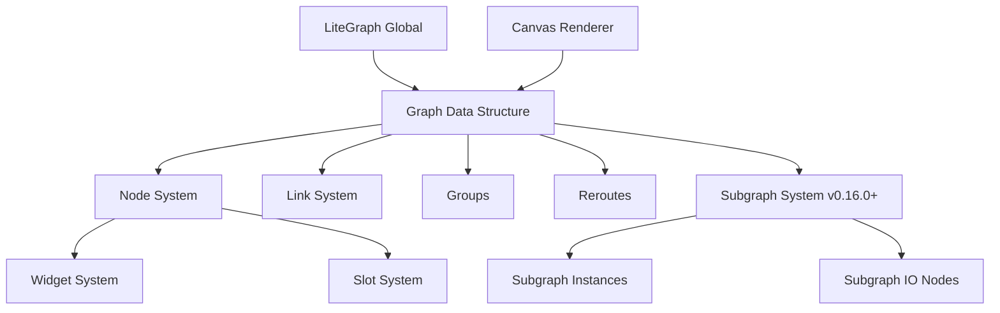

# LiteGraph.js Repository Analysis Guide

## Repository Overview

**@ComfyOrg/litegraph** is a TypeScript library for creating node-based visual programming interfaces in web browsers, specifically forked and customized for Hanzo Studio frontend applications.

- **Purpose**: Graph node editor similar to Unreal Blueprints/PureData for visual programming
- **Repository**: https://github.com/hanzoui/litegraph.js
- **Main branch**: `master`
- **Current version**: 0.16.3 (December 2025)
- **License**: MIT
- **Status**: Active development with enhanced subgraph event system

### Key Characteristics
- Fork of original litegraph.js with HanzoStudio-specific customizations
- Largely incompatible with original litegraph.js due to API changes
- Canvas-based rendering with HTML5 Canvas2D
- Supports both client-side and server-side (Node.js) execution
- No runtime dependencies, pure TypeScript implementation

## Technology Stack

### Core Technologies
- **Language**: TypeScript (strict mode, ES2022 target)
- **Build System**: Vite 6.3.5 + TypeScript compiler
- **Package Format**: Dual ESM/UMD builds with TypeScript declarations
- **Runtime**: Browser (Canvas 2D API) + Node.js support

### Development Tools
- **Testing**: Vitest 3.1.3 with JSdom environment
- **Linting**: ESLint 9.21.0 with extensive rule configuration
- **Formatting**: Prettier 3.3.3
- **Git Hooks**: Husky 9.1.7 + lint-staged 15.2.10 for pre-commit validation
- **Type Generation**: vite-plugin-dts 4.5.4 for declaration files

### Key Dependencies (Dev Only)
- TypeScript 5.8.2 with strict configuration
- Extensive ESLint configuration (Stylistic, Antfu, Unicorn, JSDoc plugins)
- Vitest for testing with snapshot support
- Added `typecheck` script for TypeScript validation (v0.16.2)

## Directory Structure

```
litegraph-clone/
├── src/                          # Main source code
│   ├── litegraph.ts             # Main library entry point
│   ├── LiteGraphGlobal.ts       # Global singleton & node registry
│   ├── LGraph.ts                # Core graph data structure
│   ├── LGraphCanvas.ts          # Canvas renderer & UI interactions
│   ├── LGraphNode.ts            # Node system & lifecycle
│   ├── LLink.ts                 # Link/connection system
│   ├── LGraphGroup.ts           # Node grouping functionality
│   ├── Reroute.ts               # Link rerouting system
│   ├── ContextMenu.ts           # Right-click menus
│   ├── DragAndScale.ts          # Viewport manipulation
│   ├── CanvasPointer.ts         # Modern pointer event handling
│   ├── canvas/                  # Rendering subsystem
│   │   ├── LinkConnector.ts     # Link creation & manipulation
│   │   ├── RenderLink.ts        # Link drawing classes
│   │   ├── FloatingRenderLink.ts # Temporary links during drag
│   │   └── measureSlots.ts      # Slot measurement utilities
│   ├── node/                    # Node slot system
│   │   ├── NodeInputSlot.ts     # Input connection points
│   │   ├── NodeOutputSlot.ts    # Output connection points
│   │   └── slotUtils.ts         # Slot helper functions
│   ├── widgets/                 # Interactive node controls
│   │   ├── BaseWidget.ts        # Widget base class
│   │   ├── NumberWidget.ts      # Numeric inputs
│   │   ├── SliderWidget.ts      # Range sliders
│   │   ├── ComboWidget.ts       # Dropdown selections
│   │   ├── TextWidget.ts        # Text inputs
│   │   └── widgetMap.ts         # Widget type registry
│   ├── subgraph/               # Nested graph system (v0.16.0+)
│   │   ├── Subgraph.ts         # Subgraph definition with event system
│   │   ├── SubgraphNode.ts     # Instance with IO change handlers
│   │   ├── SubgraphInputNode.ts # Input boundary node
│   │   ├── SubgraphOutputNode.ts # Output boundary node
│   │   ├── SubgraphInput.ts    # Input slot definitions
│   │   ├── SubgraphOutput.ts   # Output slot definitions
│   │   ├── SubgraphIONodeBase.ts # Base class for IO nodes
│   │   ├── SubgraphSlotBase.ts # Base for subgraph slots
│   │   ├── EmptySubgraphInput.ts # Empty slot for adding inputs
│   │   ├── EmptySubgraphOutput.ts # Empty slot for adding outputs
│   │   ├── ExecutableNodeDTO.ts # Flattened node for execution
│   │   └── subgraphUtils.ts    # Utility functions
│   ├── types/                  # Type definitions
│   │   ├── globalEnums.ts      # Core enumerations
│   │   ├── serialisation.ts    # Save/load types
│   │   └── utility.ts          # Utility types
│   ├── utils/                  # Helper utilities
│   │   ├── arrange.ts          # Node layout algorithms
│   │   ├── collections.ts      # Array/object helpers
│   │   └── uuid.ts             # ID generation
│   └── infrastructure/         # Base infrastructure
│       ├── CustomEventTarget.ts # Event system base
│       ├── Rectangle.ts        # Spatial calculations
│       └── SubgraphEventMap.ts # Subgraph event types (v0.16.2+)
├── test/                       # Test suite
│   ├── *.test.ts              # Unit tests
│   ├── *.integration.test.ts  # Integration tests
│   ├── __snapshots__/         # Test snapshots
│   ├── assets/                # Test data fixtures
│   └── testExtensions.ts      # Custom test utilities
├── public/css/                # CSS styles
├── dist/                      # Build output (git-ignored)
├── README.md                  # Main documentation
├── API.md                     # New API documentation
├── CONTRIBUTING.md            # Contribution guidelines
├── CLAUDE.md                  # Claude Code-specific rules
└── package.json              # Package configuration
```

## Development Workflow

### Essential Commands

```bash
# Development
npm run dev              # Start development server
npm run build           # Build for production
npm run watch           # Build in watch mode
npm run preview         # Preview production build

# Code Quality
npm run lint            # Run ESLint
npm run lint:fix        # Fix auto-fixable lint issues
npm run format          # Check Prettier formatting
npm run format:fix      # Fix formatting issues

# Testing
npm test                # Run all tests
npm test -- --watch     # Run tests in watch mode
npm test -- -t "name"   # Run specific test by name
npm test -- filename    # Run specific test file

# Type Checking
npm run typecheck       # Run TypeScript compiler (no emit) - Added in v0.16.2
tsc                     # Alternative: Run TypeScript compiler directly
```

### Pre-commit Workflow
- **Husky**: Manages git hooks
- **lint-staged**: Runs on staged files only
  - **TypeScript files**: Prettier → ESLint → TypeScript compilation
  - **JavaScript files**: Prettier → ESLint
  - **CSS files**: Prettier formatting
- **Note**: Test imports fixed to prevent circular dependencies (v0.16.1)

### Build Process
1. **TypeScript Compilation**: `tsc` for type checking
2. **Vite Build**: Creates dual ESM/UMD bundles
3. **Type Generation**: `vite-plugin-dts` generates `.d.ts` files
4. **CSS Processing**: Copies and processes stylesheets

## Critical Development Guidelines

### Code Quality Standards
- **Strict TypeScript**: No `any` usage, strict null checks enabled
- **ESLint Configuration**: Comprehensive ruleset with Stylistic, Unicorn, JSDoc plugins
- **Import Organization**: Auto-sorted imports with specific grouping rules
- **Formatting**: 2-space indentation, double quotes, trailing commas

### API Design Principles
- **Clean Public APIs**: Prioritize stable, well-defined interfaces for extensions
- **Domain-Driven Design**: Clear separation of concerns between components
- **Backward Compatibility**: Careful consideration of breaking changes
- **Extension Points**: Support for custom nodes, widgets, and behaviors

### Git Workflow
- **Main Branch**: `master`
- **Feature Branches**: Descriptive names, PR-based workflow
- **Commit Messages**: Use `[prefix]` format (e.g., `[docs]`, `[feat]`, `[fix]`)
- **No Build Commits**: Avoid committing built files to prevent merge conflicts

### Testing Requirements
- **Unit Tests**: All core functionality must have tests
- **Integration Tests**: Complex workflows require integration coverage
- **Snapshot Tests**: Serialization and rendering output verification
- **Test Isolation**: Proper setup/teardown, no shared state between tests

## Architecture & Patterns

### Core System Design



### Key Architectural Patterns

#### 1. **Registry Pattern** (`LiteGraphGlobal.ts`)
- Global node type registry for extensibility
- Centralized configuration and theming
- Factory methods for node creation

#### 2. **Component System** (`LGraphNode.ts`)
- Lifecycle callbacks: `onAdded`, `onRemoved`, `onExecute`
- Extensible via inheritance and composition
- Widget and slot composition

#### 3. **Event-Driven Architecture** (`CanvasPointer.ts`)
- Modern pointer event handling with click/drag/double-click
- Custom event targets for component communication
- Configurable interaction behaviors

#### 4. **Strategy Pattern** (Widget System)
- Different widget types implement common interface
- Pluggable rendering and interaction strategies
- Type-safe widget registration

#### 5. **Observer Pattern** (Link System)
- Graph connectivity changes trigger updates
- Automatic layout recalculation
- Change propagation through graph

#### 6. **CanvasPointer API** (Interaction System)
- Modern pointer event handling system replacing legacy code
- Provides standard click, double-click, and drag UX
- Configurable click drift and double-click detection
- Multi-select improvements (no longer requires shift for dragging multiple items)
- Bug fixes for micro-displacement and undo step issues

#### 7. **Subgraph System** (v0.16.0+, enhanced v0.16.2+)
- **Hierarchical Composition**: Graphs can contain subgraph nodes that reference other graphs
- **Definition vs Instance**: Subgraph class defines reusable templates, SubgraphNode represents instances
- **Dynamic IO**: Subgraph inputs/outputs can be added/removed/renamed dynamically
- **Event-Driven Updates**: Changes to subgraph definitions automatically update all instances
- **Execution Flattening**: Complex nested structures are flattened for efficient execution
- **Enhanced Event System (v0.16.2+)**:
  - Dedicated `SubgraphEventMap` for type-safe event handling
  - Events: `adding-input`, `input-added`, `removing-input`, `renaming-input`
  - Events: `adding-output`, `output-added`, `removing-output`, `renaming-output`
  - SubgraphNode automatically handles IO changes from parent subgraph (v0.16.3)
  - Event listeners automatically update node inputs/outputs when subgraph definition changes

### Extension Points

#### Custom Node Types
```typescript
class MyCustomNode extends LGraphNode {
  title = "My Node"
  
  constructor() {
    super()
    this.addInput("in", "number")
    this.addOutput("out", "number")
    this.addWidget("number", "value", 1)
  }
  
  onExecute() {
    const input = this.getInputData(0)
    this.setOutputData(0, input * 2)
  }
}

LiteGraph.registerNodeType("custom/mynode", MyCustomNode)
```

#### Custom Widget Types
```typescript
class MyWidget extends BaseWidget {
  draw(ctx: CanvasRenderingContext2D, node: LGraphNode, 
       widgetWidth: number, posY: number, height: number) {
    // Custom rendering logic
  }
  
  mouse(event: CanvasPointerEvent, pos: Point, node: LGraphNode): boolean {
    // Handle interaction
    return true // consumed event
  }
}
```

#### Creating and Using Subgraphs (v0.16.0+)
```typescript
// Create a subgraph from selected nodes
const subgraph = graph.createSubgraph("My Subgraph", selectedNodes)

// Or convert existing nodes to a subgraph
const subgraphNode = graph.convertToSubgraph(selectedNodes)

// Enhanced event handling (v0.16.2+)
subgraph.addEventListener("input-added", (e) => {
  console.log("New input:", e.detail.input)
})

subgraph.addEventListener("renaming-input", (e) => {
  console.log(`Input renamed from ${e.detail.oldName} to ${e.detail.newName}`)
})

subgraph.addEventListener("removing-output", (e) => {
  console.log("Removing output:", e.detail.output, "at index", e.detail.index)
})

// Access subgraph IO definitions
subgraph.inputs // Array of SubgraphInput
subgraph.outputs // Array of SubgraphOutput

// SubgraphNode automatically syncs with definition changes (v0.16.3)
// No manual update needed when subgraph IO changes
```

## Common Development Tasks

### Adding New Node Types
1. **Create Node Class**: Extend `LGraphNode`
2. **Define Interface**: Add inputs, outputs, widgets in constructor
3. **Implement Logic**: Override `onExecute()` and lifecycle methods
4. **Register Type**: Call `LiteGraph.registerNodeType()`
5. **Add Tests**: Unit tests for node behavior
6. **Update Documentation**: Document new node type

### Widget Development
1. **Extend BaseWidget**: Implement abstract methods
2. **Implement Rendering**: Override `draw()` method
3. **Handle Interactions**: Override `mouse()` method
4. **Register Widget**: Add to widget type map
5. **Test Interactions**: Test widget behavior in nodes

### Subgraph Development (v0.16.0+)
1. **Create Subgraph Definition**: Extend `Subgraph` class
2. **Define IO Interface**: Add inputs/outputs via `addInput()`/`addOutput()`
3. **Handle IO Events**: Listen for input/output changes
4. **Test Nesting**: Verify subgraphs work when nested
5. **Update Documentation**: Document subgraph behavior

### Testing New Features
1. **Unit Tests**: Test individual components in isolation
2. **Integration Tests**: Test component interactions
3. **Snapshot Tests**: Verify serialization output
4. **Manual Testing**: Use dev server for interactive testing
5. **Note**: Subgraph system currently lacks comprehensive test coverage

### Performance Optimization
1. **Profile Rendering**: Use browser dev tools
2. **Optimize Loops**: Minimize repeated calculations
3. **Cache Results**: Store expensive computations
4. **Viewport Culling**: Only render visible items
5. **Event Throttling**: Limit high-frequency updates

## Testing Strategy

### Test Organization
- **Unit Tests**: `test/*.test.ts` - Individual component testing
- **Integration Tests**: `test/*.integration.test.ts` - Cross-component workflows
- **Utilities**: `test/testExtensions.ts` - Custom fixtures and helpers

### Test Utilities
```typescript
// Custom test extension with fixtures
test("should handle node connections", ({ expect, minimalGraph }) => {
  const node1 = minimalGraph.addNode("basic/sum")
  const node2 = minimalGraph.addNode("basic/sum")
  node1.connect(0, node2, 0)
  expect(minimalGraph.links.size).toBe(1)
})
```

### Testing Gaps
- **Subgraph System**: The v0.16.0 subgraph feature lacks unit and integration tests
- **IO Event Handlers**: New event handlers for subgraph IO changes need test coverage
- **Nested Subgraph Execution**: Complex nesting scenarios require testing

### Running Tests
```bash
# All tests
npm test

# Specific test patterns
npm test -- -t "node connection"
npm test -- LGraph.test.ts

# Watch mode
npm test -- --watch

# Coverage
npm test -- --coverage
```

## Troubleshooting & Common Issues

### Build Issues
- **TypeScript Errors**: Run `tsc` to see detailed type errors
- **Lint Failures**: Run `npm run lint:fix` for auto-fixes
- **Test Failures**: Check test snapshots may need updating

### Development Issues
- **Canvas Rendering**: Check browser console for WebGL/Canvas errors
- **Performance**: Profile with browser dev tools, check for infinite loops
- **Memory Leaks**: Ensure proper cleanup in `onRemoved()` callbacks
- **Subgraph Issues**: Check for circular references, verify IO event handlers
- **Nested Subgraphs**: Ensure depth limit (1000) isn't exceeded

### Git Workflow Issues
- **Merge Conflicts**: Avoid committing build files
- **Pre-commit Failures**: Fix lint/format issues before committing
- **Branch Synchronization**: Keep feature branches updated with master

## Key Files to Understand

### Critical Files for AI Agents
1. **`src/litegraph.ts`** - Main entry point, exports overview
2. **`src/LiteGraphGlobal.ts`** - Global configuration and node registry
3. **`src/LGraph.ts`** - Core graph data structure and operations
4. **`src/LGraphNode.ts`** - Node system and lifecycle
5. **`src/LGraphCanvas.ts`** - Rendering and UI interaction
6. **`src/interfaces.ts`** - Core type definitions
7. **`src/types/globalEnums.ts`** - Important enumerations
8. **`src/subgraph/Subgraph.ts`** - Subgraph system core (v0.16.0+)
9. **`src/subgraph/SubgraphNode.ts`** - Subgraph instances with IO handlers
10. **`src/infrastructure/SubgraphEventMap.ts`** - Subgraph event types (v0.16.2+)
11. **`API.md`** - New API documentation including CanvasPointer system
12. **`test/testExtensions.ts`** - Test patterns and utilities

### Configuration Files
- **`package.json`** - Dependencies and scripts
- **`tsconfig.json`** - TypeScript configuration
- **`vite.config.mts`** - Build configuration
- **`eslint.config.js`** - Code quality rules

### Documentation Files
- **`README.md`** - Usage and installation
- **`API.md`** - New API documentation
- **`CONTRIBUTING.md`** - Development guidelines
- **`CLAUDE.md`** - Claude Code-specific development rules

## Development Context for AI Assistance

### When Working on This Codebase
1. **Read Architecture First**: Understand the component relationships
2. **Check Existing Patterns**: Follow established coding conventions
3. **Run Tests Early**: Ensure changes don't break existing functionality
4. **Consider Extensions**: Design with plugin/extension compatibility in mind
5. **Profile Performance**: Large graphs require efficient rendering

### Critical Success Factors
- **API Stability**: Changes affect thousands of users and extensions
- **Performance**: Must handle complex graphs with hundreds of nodes
- **Browser Compatibility**: Canvas 2D rendering across different browsers
- **Type Safety**: Strict TypeScript prevents runtime errors
- **Test Coverage**: Comprehensive testing prevents regressions (note: subgraph system needs tests)

### Recent Development Focus (v0.16.x)
- **Subgraph System**: Major feature addition enabling hierarchical graph composition (v0.16.0)
- **Enhanced Event System (v0.16.2)**: Type-safe event handling for subgraph IO changes
- **Automatic IO Sync (v0.16.3)**: SubgraphNode instances automatically update when parent subgraph IO changes
- **Node Interaction**: Improved resize behavior and pointer handling
- **IO Node Enhancements**: Better support for dynamic input/output management
- **Widget Fixes**: Resolved custom widget rendering issues
- **CI/CD Improvements**: 
  - Fixed test imports to prevent circular dependencies (v0.16.1)
  - Added typecheck script to package.json (v0.16.2)
  - Fixed prerelease version tag in CI (v0.16.3)
  - Improved release process
- **Trackpad Support**: Fixed control + mouse-wheel zoom in trackpad mode (v0.16.2)

### Upcoming Development Areas
Based on open issues:
- **Node Slot Configuration**: Rewrite of slot configuration process (#1099)
- **IO Node Linking**: Direct IO-to-IO node connections (#1085)
- **Link Drop Support**: Dropping links on empty IO node backgrounds (#1083)
- **Code Refactoring**: Split large classes (LGraph, LGraphCanvas, LGraphNode) into smaller, manageable objects (#1045-1048)

This repository serves as the core graph editing engine for Hanzo Studio, making it critical infrastructure that requires careful, well-tested changes with strong consideration for backward compatibility and performance.